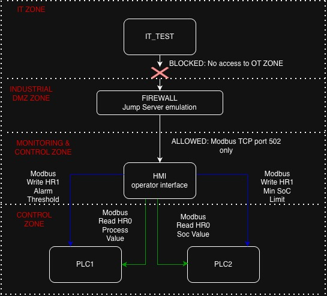
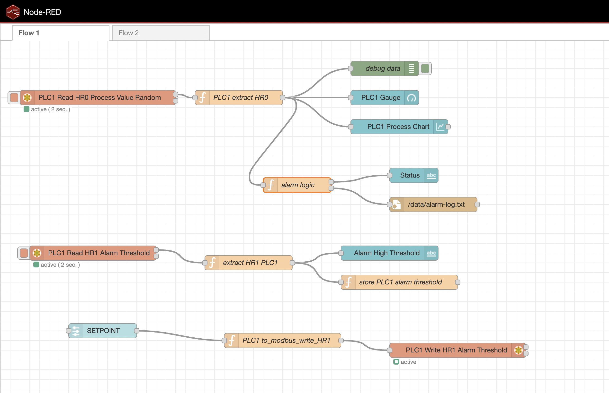

OT Security Lab – PLC, Modbus, HMI, Firewall

IN PROGRESS

This project is a small OT (Operational Technology) lab running entirely in Docker.  

It simulates two PLCs, an HMI, an OT firewall and an IT workstation, focusing on:

- secure Modbus TCP communication in an OT network,
- basic process and alarm logic,
- BESS (Battery Energy Storage System) behaviour,
- logging of alarm events in a format ready for SIEM / SOC.

Architecture

Containers:

- PLC1 (plc) – generic process controller (e.g. temperature / level), exposed via Modbus TCP.
- PLC2 (plc2) – BESS controller (SoC and minimum SoC limit), also Modbus TCP.
- HMI (hmi) – Node-RED instance:
  - acts as an HMI / mini-SCADA,
  - reads and writes Modbus registers,
  - implements alarm logic and logging.
- Firewall (fw) – Linux container with `iptables`
  - enforces OT firewall rules,
  - allows only HMI → PLC1/PLC2 Modbus TCP,
  - logs and drops IT → PLC traffic.
- IT workstation (it_test) – simulates an IT-side host / potential attacker.

Addressing (inside the Docker network):

- `plc`   → 10.0.0.10 (Modbus TCP server)
- `plc2`  → 10.0.0.11 (Modbus TCP server – BESS)
- `fw`    → 10.0.0.5  (router + firewall between IT and OT)
- `hmi`   → 10.0.0.30 (Node-RED / HMI)
- `it_test` → 10.0.0.2 (IT host)

System Architecture Diagram

       

OT Zones:

- Zone 1 – PLCs (Critical Process Controllers)
- Zone 2 – HMI (Monitoring only)
- Zone 3 – IT Network (Restricted – blocked access to PLC)

Security concepts implemented:

- Zone & Conduit architecture (IEC 62443)  
- Modbus traffic control (TCP/502)  
- Segmentation and communication filtering  
- Alarm logic & threshold monitoring  
- Prevention of write commands from HMI to PLC unless explicitly allowed  
- Basic logging mechanism with JSON logs  

Technologies Used

- ICS Simulation | Docker / Docker Compose 
- PLC Logic | Python (`pymodbus`) 
- HMI | Node-RED 
- Network Control | `iptables`, Linux 
- Protocol | Modbus TCP 
- Dashboard | Node-RED UI 
- Logging | JSON → file (`/data/alarm-log.txt`) 

Screenshots:

HMI DASHBOARD - real-time OT process monitoring

This dashboard is designated to displays real-time monitoring of two industrial PLCs similar to HMI?SCADA interace.

 PLC1 – Process Monitoring (e.g., temperature):
 
- Live chart using Modbus TCP (HR0 read).
- Alarm threshold dynamically adjustable via UI slider (written to PLC using Modbus).
- Status logic with conditional display: OK, Elevated, or Alarm, based on threshold.
- Gauge visualization for fast operator situational awareness.

 PLC2 – BESS (Battery Energy Storage System):
 
- Displays current State of Charge (SoC).
- Operator can define minimum allowed SoC level.
- Alarm logic alerts when SoC < limit.

Flow 1 - PLC1 Process Logic Alarm Simulation

This flow simulates a critical industrial process controlled by PLC1:

- Modbus READ (HR0): Retrieves process value at fixed intervals.
- Function node (“extract HR0”): Converts raw register value for processing.
- Alarm logic: Determines severity level (OK / Elevated / High Alarm).
- UI Slider (“SETPOINT”): Operator dynamically adjusts alarm threshold.
- Modbus WRITE (HR1): Writes new threshold to PLC.
- Alarm event logging: Persisted to /data/alarm-log.txt for audit/security analysis.

Flow 2 - PLC2 BESS Simulation

This flow represents a basic Battery Energy Storage System (BESS) control simulation:

- Modbus READ (HR0): Reads current State of Charge (%).
- Modbus READ (HR1): Retrieves minimum allowed SoC value.
- Alarm logic: If current SoC drops below limit → Alarm triggered.
- UI Slider (“Set Min SoC”): Operator can change minimum SoC threshold.
- Modbus WRITE: Updates new threshold in PLC memory.
- Event Logging: Alarm conditions are written to the same log for centralized tracking.

How to Run:

Build and start containers:

docker compose up --build

Access Node-RED HMI:

http://localhost:1880/ui

Enter firewall container to check rules:

docker exec -it fw sh

iptables -L -v -n
